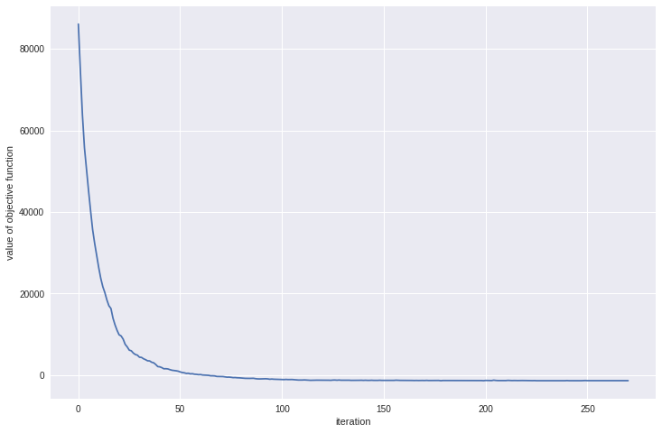
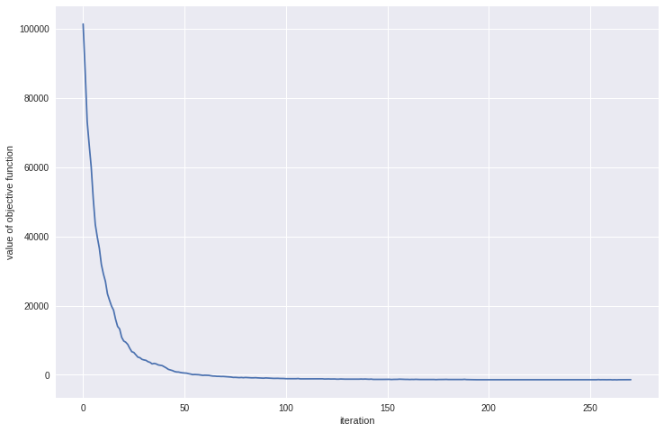

# Simulated Annealing

Let me introduce the [Simulated Annealing](https://github.com/gianmarcodonetti/optimization/blob/master/optimization/heuristic/simulatedannealing.py) service.

## Setup

Importing the required modules:

```python
import torch
import matplotlib.pyplot as plt
import numpy as np
from functools import partial
import cProfile
import zipfile
import sys

from optimization.heuristic.simulatedannealing import simulated_annealing
```

Set a random seed a the required parameters:

```python
np.random.seed = 123

minimization = True
t_initial = 80
t_final = 1e-80
ctr_max = 100
alpha = 0.5
```

## Reading the data

We are trying to solve a QUBO problem. We have already built our matrix of coefficients and we can read it:

```python
qubo_matrix = np.loadtxt('qubo_matrix.dat')
assert qubo_matrix.shape[0] == qubo_matrix.shape[1]
N = qubo_matrix.shape[0]
```

We can now start the annealing process.

## NumPy

The first framework we work with is **NumPy**.

As initial step, let's pick a random initial solution and define all the required function for the simulation to start:

```python
def generate_initial_solution(size):
    clipper = lambda t: 0 if t < 0.5 else 1
    vfunc = np.vectorize(clipper)
    x_raw = np.random.random(size=size)
    x = vfunc(x_raw)
    return x

def qubo_obj_function_numpy(x, Q):
    return x.dot(Q).dot(x.T)

def neigh_numpy(v, n_bit_to_mutate=2):
    v_copy = v.copy()
    bits = np.random.randint(0, v.size, n_bit_to_mutate)
    for bit in bits:
        v_copy[bit] = 1 - v_copy[bit]
    return v_copy

obj_func = partial(qubo_obj_function_numpy, Q=qubo_matrix)
nb_func = partial(neigh_numpy, n_bit_to_mutate=2)

h = generate_initial_solution(N)
```

Now, we can start the hunting. We also want to profile the function calls, the we exploit the cProfile service.

```python
prof = cProfile.Profile()
args = [h, obj_func, nb_func]
kwargs = {
    't_initial': t_initial, 't_final': t_final,
    'ctr_max': ctr_max, 'alpha': alpha,
    'minimization': minimization, 'verbose': False, 'caching': True
}

h_final, cache = prof.runcall(simulated_annealing, *args, **kwargs)

prof.print_stats()
```

Output:
```
         377090 function calls in 42.397 seconds

   Ordered by: standard name

   ncalls  tottime  percall  cumtime  percall filename:lineno(function)
    54054    0.155    0.000   41.344    0.001 <ipython-input-18-4e4dd4d5ca13>:1(qubo_obj_function_numpy)
    27027    0.216    0.000    0.514    0.000 <ipython-input-18-4e4dd4d5ca13>:4(neigh_numpy_2)
        1    0.045    0.045   42.397   42.397 <ipython-input-7-3d9c884bd6c9>:1(simulated_annealing)
    27027    0.048    0.000    0.048    0.000 <ipython-input-7-3d9c884bd6c9>:14(<lambda>)
    27027    0.295    0.000   41.743    0.002 <ipython-input-7-3d9c884bd6c9>:33(evaluate_move)
    27027    0.087    0.000   42.344    0.002 <ipython-input-7-3d9c884bd6c9>:6(iteration)
    27027    0.008    0.000    0.008    0.000 {method 'append' of 'list' objects}
    27027    0.061    0.000    0.061    0.000 {method 'copy' of 'numpy.ndarray' objects}
        1    0.000    0.000    0.000    0.000 {method 'disable' of '_lsprof.Profiler' objects}
   108108   41.189    0.000   41.189    0.000 {method 'dot' of 'numpy.ndarray' objects}
    27027    0.237    0.000    0.237    0.000 {method 'randint' of 'mtrand.RandomState' objects}
    25737    0.057    0.000    0.057    0.000 {method 'random_sample' of 'mtrand.RandomState' objects}
```


We should now inspect the final solution and the explorated solution space:

```python
print("Final solution:")
print("f(x) = {}".format(obj_func(h_final)))
print("Len cache:", len(cache))
print("Explored space: {} %".format(len(cache) / 2**len(h_final) * 100))

_ = plt.figure(figsize=(12, 8))
plt.plot([qubo_obj_function_numpy(c, qubo_matrix) for c in cache[::100]])
plt.xlabel('iteration')
plt.ylabel('value of objective function')
plt.show()

del cache
```

Output:
```
Final solution:
f(x) = -1440.6
Len cache: 27028
Explored space: 0.0 %
```




## PyTorch

The ***simulated_annealing*** function I have developed is so generic
that we can also run it on **GPU**s, exploiting, for example,
the **PyTorch** framework.
Indeed, we can define our solutions and the QUBO matrix in
torch Tensors, together with adequate objective and neighbour functions.

Let's recreate the flow we have developed for the numpy framework.

Creating the initial solution and the QUBO matrix as torch tensors:
```python
torch.cuda.empty_cache()

h_torch = torch.cuda.FloatTensor(generate_initial_solution(N))
Q_torch = torch.cuda.FloatTensor(qubo_matrix).share_memory_()
```

Now we can define all the required function for the simulation to start with a *torchy slang*:

```python
def qubo_obj_function_torch(_x_torch, _qubo_torch):
    return torch.matmul(torch.matmul(_x_torch, _qubo_torch), _x_torch)

def neigh_torch(v_torch, v_size, n_bit_to_mutate=2):
    v_copy = v_torch.clone()
    bits = np.random.randint(0, v_size, n_bit_to_mutate)
    for bit in bits:
        v_copy[bit] = 1 - v_copy[bit]
    return v_copy

obj_func_torch = partial(qubo_obj_function_torch, Q_torch=Q_torch)
nb_func_torch = partial(neigh_torch, v_size=N, n_bit_to_mutate=1)
```


We can exploit the same APIs as before:

```python
prof = cProfile.Profile()
args = [h_torch, obj_func_torch, nb_func_torch]
kwargs = {
    't_initial': t_initial, 't_final': t_final,
    'ctr_max': ctr_max, 'alpha': alpha,
    'minimization': minimization, 'verbose': False, 'caching': True
}

h_final, cache = prof.runcall(simulated_annealing, *args, **kwargs)

prof.print_stats()
```

Output:
```
         809576 function calls in 17.470 seconds

   Ordered by: standard name

   ncalls  tottime  percall  cumtime  percall filename:lineno(function)
    54054    0.279    0.000   12.291    0.000 <ipython-input-27-e3aa1d3caa20>:1(qubo_obj_function_torch_2)
    27027    3.570    0.000    4.736    0.000 <ipython-input-28-748db8d01090>:1(neigh_torch)
        1    0.037    0.037   17.470   17.470 <ipython-input-7-3d9c884bd6c9>:1(simulated_annealing)
    27027    0.016    0.000    0.016    0.000 <ipython-input-7-3d9c884bd6c9>:14(<lambda>)
    27027    0.199    0.000   12.564    0.000 <ipython-input-7-3d9c884bd6c9>:33(evaluate_move)
    27027    0.128    0.000   17.428    0.001 <ipython-input-7-3d9c884bd6c9>:6(iteration)
   108108    0.332    0.000   12.011    0.000 functional.py:124(matmul)
    54054    8.941    0.000    8.941    0.000 {built-in method torch._C.dot}
    54054    2.100    0.000    2.100    0.000 {built-in method torch._C.mm}
    27027    0.006    0.000    0.006    0.000 {method 'append' of 'list' objects}
    27027    0.889    0.000    0.889    0.000 {method 'clone' of 'torch._C.CudaFloatTensorBase' objects}
   216216    0.091    0.000    0.091    0.000 {method 'dim' of 'torch._C.CudaFloatTensorBase' objects}
        1    0.000    0.000    0.000    0.000 {method 'disable' of '_lsprof.Profiler' objects}
    27027    0.276    0.000    0.276    0.000 {method 'randint' of 'mtrand.RandomState' objects}
    25791    0.059    0.000    0.059    0.000 {method 'random_sample' of 'mtrand.RandomState' objects}
    54054    0.254    0.000    0.254    0.000 {method 'squeeze_' of 'torch._C.CudaFloatTensorBase' objects}
    54054    0.295    0.000    0.295    0.000 {method 'unsqueeze' of 'torch._C.CudaFloatTensorBase' objects}
```

We should now inspect the final solution and the explorated solution space:

```python
print("Final solution:")
print("f(x) = {}".format(obj_func_torch(h_final)))
print("Len cache:", len(cache))
print("Explored space: {} %".format(len(cache) / 2**len(h_final) * 100))

_ = plt.figure(figsize=(12, 8))
plt.plot([obj_func_torch(c) for c in cache[::100]])
plt.xlabel('iteration')
plt.ylabel('value of objective function')
plt.show()

del cache
```

Output:
```
Final solution:
f(x) = -1470.0
Len cache: 27028
Explored space: 0.0 %
```



